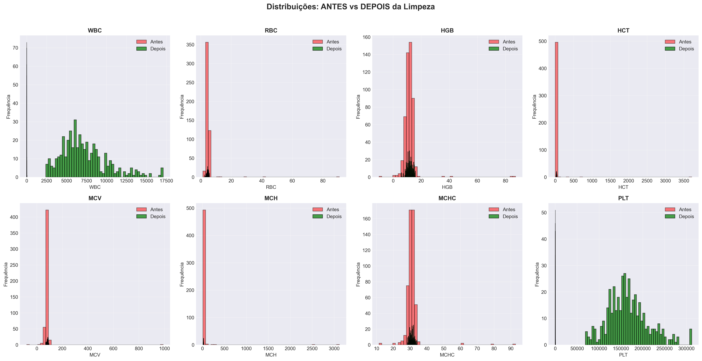
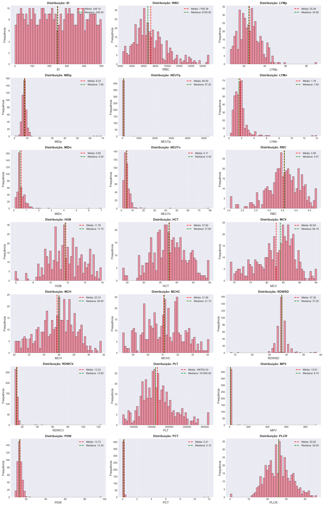
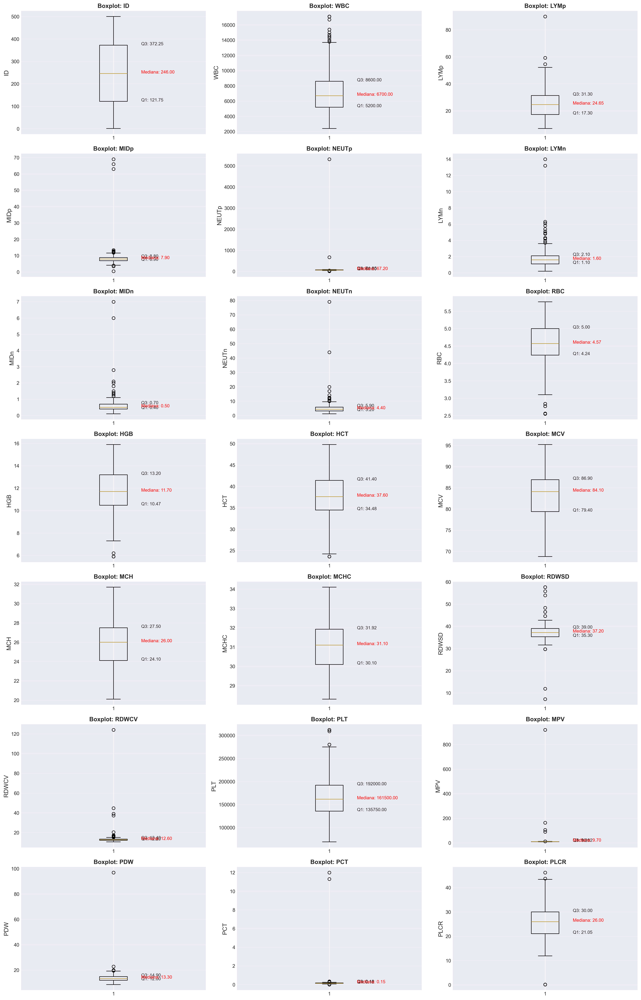
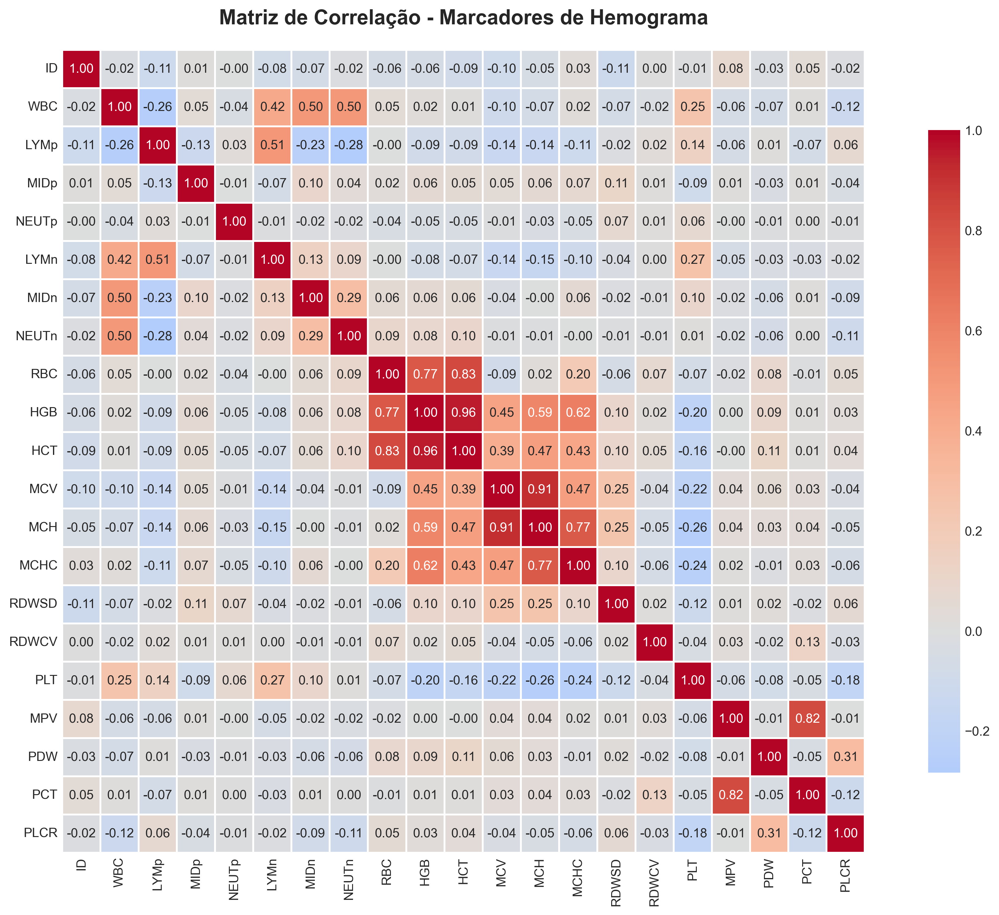
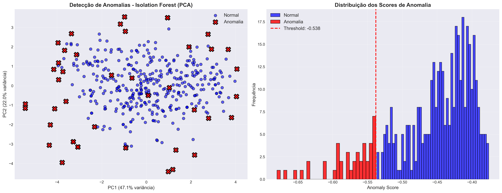
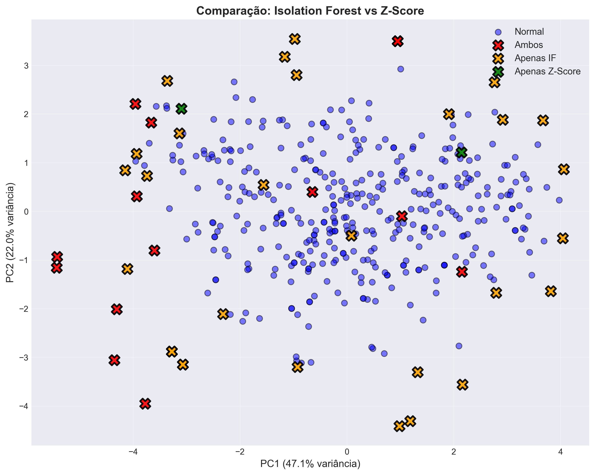
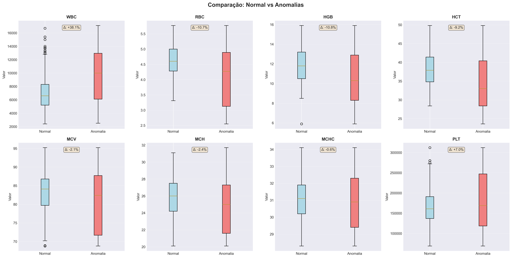
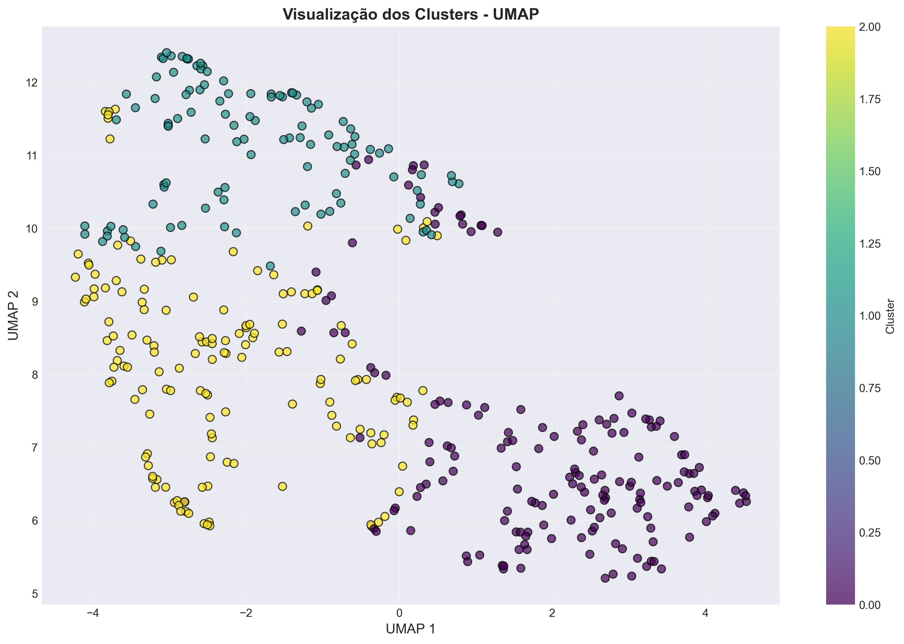
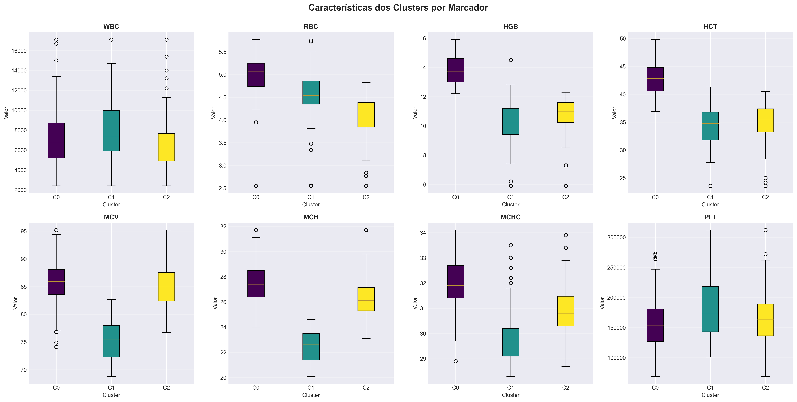

# 🔬 Análise Inteligente de Hemograma com IA

## 📋 Visão Geral do Projeto

Este projeto aplica técnicas de Ciência de Dados e Machine Learning para análise inteligente de exames de hemograma (Complete Blood Count - CBC), com o objetivo de auxiliar profissionais de saúde na identificação de padrões, anomalias e perfis hematológicos. São usadas abordagens como limpeza de dados, EDA, detecção de anomalias, clusterização e classificação.

**⚠️ AVISO IMPORTANTE:** Este projeto tem fins **exclusivamente educacionais** e **não substitui** diagnóstico médico profissional. Todas as interpretações clínicas são baseadas em literatura científica e devem ser validadas por especialistas.


## 🧠 Resumo Executivo

- Dataset: 424 exames de hemograma (dados sintéticos – Kaggle)
- Técnicas: EDA, Isolation Forest, Z-score, K-Means, Random Forest
- Principais resultados:
  - 3 perfis hematológicos distintos identificados
  - 14 anomalias robustas detectadas por múltiplos métodos
  - Classificação Normal vs Alterado com F1 médio de 99.23%
  - Diferencial: interpretação clínica + discussão crítica de limitações

## 🎯 Objetivos

- Explorar e visualizar padrões em dados de hemograma.
- Detectar anomalias em exames (valores potencialmente críticos).
- Agrupar pacientes por perfis hematológicos similares (clusterização).
- Classificar exames como normais ou alterados.
- Identificar quais marcadores mais influenciam resultados alterados.

## 👨‍🔬 Observações

Este projeto foi desenvolvido de forma individual, incluindo:
- Definição do problema e escopo
- Limpeza e validação dos dados
- Escolha e implementação dos modelos
- Interpretação estatística e clínica dos resultados
- Escrita da documentação técnica


## 🔍 Metodologia e Resultados Visuais

### 1. Limpeza e Pré-processamento

A limpeza foi essencial para remover valores fisicamente impossíveis e ajustar a escala dos dados laboratoriais. Abaixo, a comparação das distribuições antes e depois do tratamento (Winsorização e limpeza de ruídos).



### 2. Análise Exploratória (EDA)

Exploramos a variabilidade de cada marcador e como eles se correlacionam. Marcadores como HGB, HCT e RBC apresentam, como esperado, uma correlação positiva muito forte.

| Distribuição dos Marcadores | Variabilidade (Boxplots) |
|:---:|:---:|
|  |  |

**Matriz de Correlação:**



### 3. Detecção de Anomalias

Utilizamos **Isolation Forest** e **Z-Score** para identificar exames que fogem drasticamente do padrão normal. No gráfico de componentes principais (PCA), as anomalias (em vermelho) representam os casos que mais se afastam do "núcleo" de normalidade.



**Comparação de Métodos e Caracterização:**

Identificamos 14 casos críticos onde ambos os métodos concordaram. As anomalias apresentam, em média, um WBC (Leucócitos) 38% superior ao grupo normal.

| Comparação IF vs Z-Score | Perfil Clínico das Anomalias |
|:---:|:---:|
|  |  |

### 4. Clusterização (Perfis Hematológicos)

Agrupamos os pacientes em 3 clusters distintos utilizando K-Means. A visualização via **UMAP** e **PCA** confirma a separação clara dos perfis.



**Análise dos Clusters:**
- **Cluster 0:** Perfil dentro da normalidade.
- **Cluster 1:** Tendência anêmica (RBC e HGB significativamente baixos).
- **Cluster 2:** Perfil com MCV/MCH elevado.



---

## 🛠️ Tecnologias Utilizadas

- **Linguagem:** Python
- **Bibliotecas:** Pandas, Scikit-learn, Seaborn, Matplotlib, UMAP-learn.
- **Modelos:** Isolation Forest, K-Means, Random Forest.

## 🗂️ Estrutura do Projeto

```
hemograma-ia-analise/
│
├── data/
│   ├── raw/                    # Dados brutos do Kaggle
│   └── processed/              # Dados tratados e prontos para modelagem (ex.: cbc_limpo.csv)
│
├── notebooks/
│   ├── 00_limpeza_dados.ipynb # Limpeza e pré-processamento
│   ├── 01_eda.ipynb           # Análise Exploratória de Dados
│   ├── 02_anomalias.ipynb     # Detecção de Anomalias
│   ├── 03_clusterizacao.ipynb # Clusterização de Perfis
│   └── 04_classificacao.ipynb # Modelo de Classificação
│
├── src/
│   ├── preprocessing.py        # Funções de pré-processamento
│   ├── models.py              # Modelos de ML
│   └── utils.py               # Funções utilitárias
│
├── reports/
│   └── figures/               # Gráficos e visualizações
│
├── requirements.txt           # Dependências do projeto
└── README.md                  # Este arquivo
```

## 🚀 Como Executar

### 1. Clonar o repositório
```bash
git clone https://github.com/seu-usuario/hemograma-ia-analise.git
cd hemograma-ia-analise
```

### 2. Criar ambiente virtual
```bash
python -m venv venv
source venv/bin/activate  # Linux/Mac
venv\Scripts\activate     # Windows
```

### 3. Instalar dependências
```bash
pip install -r requirements.txt
```

### 4. Baixar o dataset
- Acesse: https://www.kaggle.com/datasets/ahmedelsayedtaha/complete-blood-count-cbc-test
- Baixe o arquivo principal e coloque em `data/raw/`.

### 5. Executar os notebooks
```bash
jupyter notebook
```

Execute na ordem: 00_limpeza_dados.ipynb → 01_eda.ipynb → 02_anomalias.ipynb → 03_clusterizacao.ipynb → 04_classificacao.ipynb.

## 📊 Dataset

**Fonte:** "CBC Dataset" no Kaggle (https://www.kaggle.com/datasets/ahmedelsayedtaha/complete-blood-count-cbc-test). Contém ~500 registros anonimizados, com características sintéticas ou simuladas, amplamente utilizados para fins educacionais.

**Variáveis principais (Explicações Clínicas):**
- **Hemoglobina (HGB, g/dL)**: Proteína nos glóbulos vermelhos que transporta oxigênio. Valores baixos podem indicar anemia (ex.: deficiência de ferro ou perda sanguínea). Fonte: Mayo Clinic - "Complete blood count (CBC)" (https://www.mayoclinic.org/tests-procedures/complete-blood-count/about/pac-20384919).

- **Hematócrito (HCT, %)**: Porcentagem de volume sanguíneo ocupado por glóbulos vermelhos. Relacionado à hidratação e anemia. Fonte: WHO - "Haemoglobin concentrations for the diagnosis of anaemia" (https://www.who.int/publications/i/item/WHO-NMH-NHD-MNM-11.1).

- **VCM - Volume Corpuscular Médio (MCV, fL)**: Tamanho médio dos glóbulos vermelhos. Alto em anemias macrocíticas (ex.: deficiência de B12); baixo em microcíticas (ex.: ferropenia). Fonte: American Society of Hematology (ASH) - "Blood Basics" (https://www.hematology.org/education/patients/blood-basics).

- **HCM - Hemoglobina Corpuscular Média (MCH, pg)**: Quantidade média de hemoglobina por glóbulo vermelho. Similar ao MCV para classificar anemias. Fonte: NIH MedlinePlus - "Complete Blood Count" (https://medlineplus.gov/lab-tests/complete-blood-count-cbc/).

- **CHCM - Concentração de Hemoglobina Corpuscular Média (MCHC, g/dL)**: Concentração de hemoglobina nos glóbulos vermelhos. Baixo em hipocromia. Fonte: Cleveland Clinic - "Complete Blood Count (CBC)" (https://my.clevelandclinic.org/health/diagnostics/4053-complete-blood-count).

- **Leucócitos (WBC, células/μL)**: Células brancas do sangue. Alto sugere infecção/inflamação; baixo imunossupressão. Fonte: Cleveland Clinic - "High White Blood Cell Count" (https://my.clevelandclinic.org/health/symptoms/17704-high-white-blood-cell-count).

- **Plaquetas (PLT, células/μL)**: Envolvidas na coagulação. Baixo (trombocitopenia) aumenta risco de sangramento. Fonte: Mayo Clinic - "Thrombocytopenia" (https://www.mayoclinic.org/diseases-conditions/thrombocytopenia/symptoms-causes/syc-20378293).

- Outras métricas derivadas (ex.: RDW, MPV): Variabilidade no tamanho de glóbulos vermelhos (RDW) ou plaquetas (MPV), úteis para diferenciar condições.

Valores de referência variam por idade/sexo, mas o projeto usa ranges genéricos (ex.: HGB 12-18 g/dL). Em contextos reais, ajustar com guidelines como os da WHO.

## 🧠 Métodos de Data Science Utilizados

- **Winsorização**: Limita outliers substituindo valores extremos por percentis (ex.: 1% e 99%). Evita distorções em modelos. Fonte: "Robust Statistics" por Huber (1981); Pandas docs: https://pandas.pydata.org/docs/reference/api/pandas.Series.clip.html.

- **StandardScaler**: Padroniza features para média 0 e variância 1, essencial para algoritmos sensíveis a escala (ex.: K-Means). Fonte: Scikit-learn Preprocessing: https://scikit-learn.org/stable/modules/preprocessing.html.

- **Isolation Forest**: Algoritmo de detecção de anomalias que isola pontos atípicos via árvores aleatórias. Eficiente para dados de alta dimensionalidade. Fonte: "Isolation Forest" por Liu et al. (2008), IEEE ICDM: https://ieeexplore.ieee.org/document/4781136.

- **Z-Score Multivariado**: Mede desvios da média em múltiplas dimensões; threshold >3 indica anomalias. Fonte: "Multivariate Statistical Methods" por Morrison (2005); Scikit-learn: https://scikit-learn.org/stable/modules/outlier_detection.html.

- **K-Means Clustering**: Agrupa dados em K clusters minimizando variância interna. Usado com Elbow/Silhouette para otimização. Fonte: "K-means Clustering" por Hartigan & Wong (1979); Scikit-learn: https://scikit-learn.org/stable/modules/clustering.html#k-means.

- **PCA (Principal Component Analysis)**: Reduz dimensionalidade projetando dados em componentes principais. Fonte: "Principal Component Analysis" por Jolliffe (2002); Scikit-learn: https://scikit-learn.org/stable/modules/decomposition.html#pca.

- **UMAP (Uniform Manifold Approximation and Projection)**: Redução não-linear de dimensionalidade, preservando estrutura local/global. Fonte: "UMAP" por McInnes et al. (2018), arXiv: https://arxiv.org/abs/1802.03426.

- **Random Forest Classifier**: Ensemble de árvores de decisão para classificação, com feature importance. Robusto a overfitting. Fonte: "Random Forests" por Breiman (2001), Machine Learning: https://link.springer.com/article/10.1023/A:1010933404324.

## 📈 Principais Resultados

### Limpeza e Pré-processamento
- **Técnicas**: Remoção de valores impossíveis (ex.: HGB negativa ou >20 g/dL, HCT >100%), correção de unidades (WBC/PLT multiplicados por 1000), winsorização de outliers (percentis 1-99%).
- **Explicação Clínica**: Valores impossíveis indicam erros laboratoriais; correções evitam vieses em análises. Fonte: NIH - "Complete Blood Count" (https://medlineplus.gov/lab-tests/complete-blood-count-cbc/).
- **Resultado**: Dataset reduzido para 424 registros válidos (84.8% de retenção).

### Análise Exploratória (EDA)
- **Técnicas**: Estatísticas descritivas, histogramas, matriz de correlação, detecção de outliers via Z-score.
- **Explicação Clínica**: Correlações (ex.: HGB/HCT) ajudam a identificar padrões como anemia; outliers podem sinalizar condições patológicas. Fonte: CDC - "Anemia or Iron Deficiency" (https://www.cdc.gov/nchs/fastats/anemia.htm).
- **Insights**: Correlações fortes entre HGB/HCT; ~36% de plaquetas abaixo do normal.

### Detecção de Anomalias
- **Técnicas**: Isolation Forest (contaminação 0.05) e Z-score multivariado (threshold 3).
- **Explicação Clínica**: Anomalias (ex.: WBC >11.000) sugerem infecções; RBC baixo, anemias graves. Usado para priorizar casos críticos. Fonte: "Machine Learning in Hematology: A Review" - Journal of Hematology & Oncology (2020), DOI: 10.1186/s13045-020-00965-6.
- **Resultado**:
  - 43 anomalias detectadas pelo Isolation Forest (10.1%), indicando maior sensibilidade para desvios multivariados;
  - 16 anomalias detectadas pelo Z-score multivariado (3.8%), refletindo casos mais extremos;
  - 14 casos foram concordantes entre ambos os métodos, considerados anomalias mais robustas e de maior relevância clínica potencial (ex.: infecções ou anemias mais acentuadas).

### Clusterização
- **Técnicas**: K-Means (3 clusters ótimos via Elbow/Silhouette), PCA/UMAP para visualização.
- **Explicação Clínica**: Clusters como "Anêmico" (RBC/HGB baixos) ou "Inflamatório" (WBC alto) ajudam na estratificação de pacientes. Fonte: ASH - "Blood Basics" (https://www.hematology.org/education/patients/blood-basics).
- **Resultado**: 3 grupos distintos; ex.: Cluster 1 (Anêmico) com RBC médio 4.54 e HGB 10.22.

### Classificação
- **Técnicas**: Random Forest (100 árvores, balanceamento), validação cruzada.
- **Explicação Clínica**: Classifica como "Normal" ou "Alterado" baseado em referências; útil para triagem. Não diagnostica. Fonte: Mayo Clinic - "CBC" (https://www.mayoclinic.org/tests-procedures/complete-blood-count/about/pac-20384919).
- **Resultado**: Acurácia 100%; F1-Score médio 99.23%; Top features: MCHC (0.219), MCH (0.210), PLT (0.183).

⚠️ **Observação sobre a performance**:  
Embora o modelo tenha apresentado desempenho próximo de 100%, esse resultado deve ser interpretado com cautela. O dataset utilizado é relativamente pequeno, bem limpo e apresenta separação clara entre classes após o pré-processamento, o que favorece modelos baseados em árvores como o Random Forest. Em contextos reais, em conjuntos de dados com mais ruido e populações heterogêneas, espera-se desempenho inferior, portanto volto a reforçar a necessidade de validação externa antes do uso em produção.

## 🏥 Aplicações Clínicas

**Para Médicos:**
- Triagem automática e priorização de casos alterados.
- Identificação de padrões para investigação adicional.

**Para Laboratórios:**
- Controle de qualidade e detecção de erros.

**Do ponto de vista de negócios:** 
- O modelo pode reduzir carga operacional ao priorizar exames alterados, auxiliar no controle de qualidade laboratorial e servir como camada inicial de apoio à decisão, sem substituir profissionais.

## ⚠️ Limitações

- Modelo baseado em dados sintéticos; requer validação real.
- Interpretações clínicas são genéricas e não diagnósticas.
- Não considera variáveis como idade/sexo para ranges personalizados.

## 🔮 Próximos Passos

- Incorporar mais variáveis clínicas (ex.: idade, sexo).
- Testar Deep Learning (ex.: Autoencoders para anomalias).
- Validação externa com dados hospitalares.
- Desenvolver interface web para testes.

## 👨‍💻 Autor

Gustavo Henrique da Silva
- LinkedIn: www.linkedin.com/in/gustavo-henrique-silva-a6b826268
- GitHub: https://github.com/ghs-mk?tab=repositories

## 📄 Licença

Este projeto está sob licença MIT.

## 🙏 Agradecimentos

- Dataset: Ahmed Hyb via Kaggle.
- Comunidade de Data Science e Healthcare Analytics.

## 📚 Fontes e Referências

- **Aspectos Clínicos**: 

Mayo Clinic (CBC: https://www.mayoclinic.org/tests-procedures/complete-blood-count/about/pac-20384919); 
WHO (Anemia: https://www.who.int/publications/i/item/WHO-NMH-NHD-MNM-11.1);
ASH (Blood Basics: https://www.hematology.org/education/patients/blood-basics);
NIH MedlinePlus (CBC: https://medlineplus.gov/lab-tests/complete-blood-count-cbc/); 
Cleveland Clinic (WBC: https://my.clevelandclinic.org/health/symptoms/17704-high-white-blood-cell-count); 
CDC (Anemia: https://www.cdc.gov/nchs/fastats/anemia.htm);
Mayo Clinic (Thrombocytopenia: https://www.mayoclinic.org/diseases-conditions/thrombocytopenia/symptoms-causes/syc-20378293);
Journal of Hematology & Oncology (ML in Hematology: DOI: 10.1186/s13045-020-00965-6).

- **Métodos de Data Science**:

Liu et al. (Isolation Forest: https://ieeexplore.ieee.org/document/4781136);
Breiman (Random Forests: https://link.springer.com/article/10.1023/A:1010933404324); McInnes et al. (UMAP: https://arxiv.org/abs/1802.03426);
Scikit-learn docs (Clustering: https://scikit-learn.org/stable/modules/clustering.html;
PCA: https://scikit-learn.org/stable/modules/decomposition.html#pca;
Preprocessing: https://scikit-learn.org/stable/modules/preprocessing.html).


- **Dataset**: https://www.kaggle.com/datasets/ahmedhyb/cbc-dataset.

---

**Nota Ética:** Todos os dados são anônimos e o projeto respeita a privacidade dos pacientes.

**Nota Clínica:** Todas as afirmações clínicas apresentadas foram fundamentadas em literatura científica amplamente aceita, conforme referências listadas, e devem ser interpretadas exclusivamente no contexto educacional do projeto(valores de referência, limites biológicos, interpretações de anemia/inflamação/trombocitopenia, benefícios para triagem/priorização).
